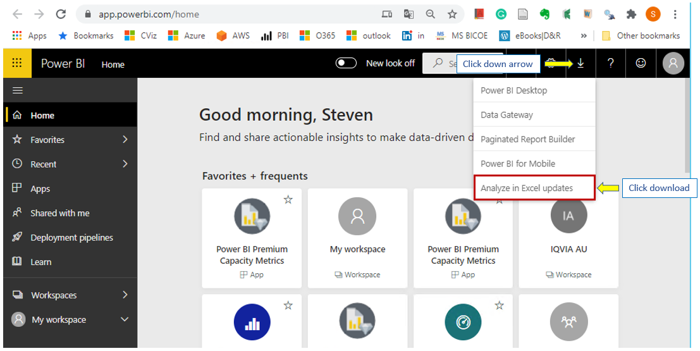
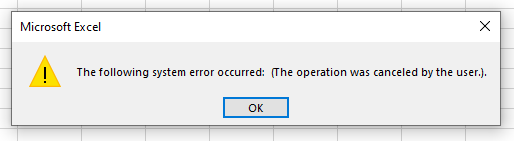
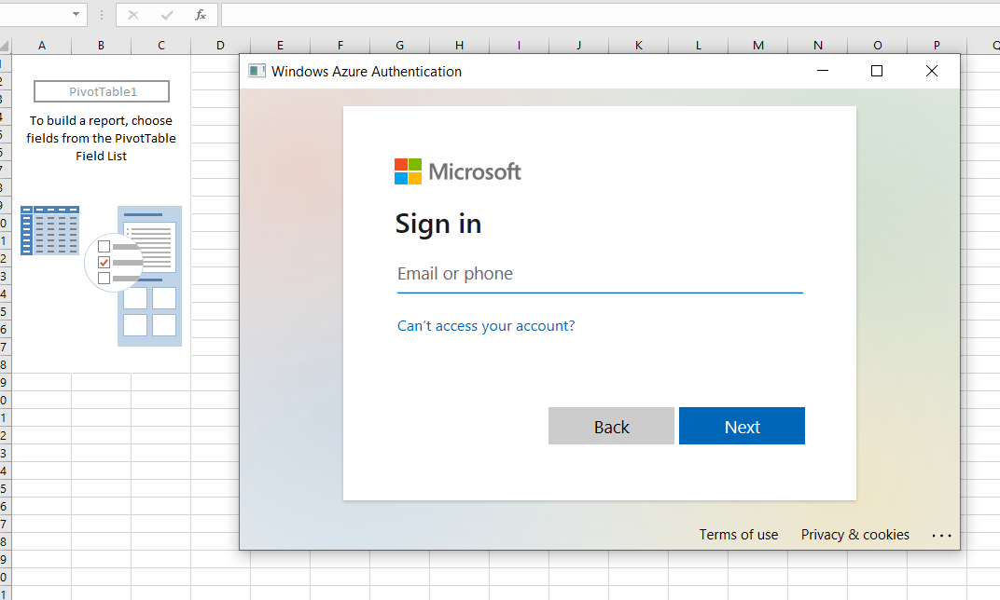
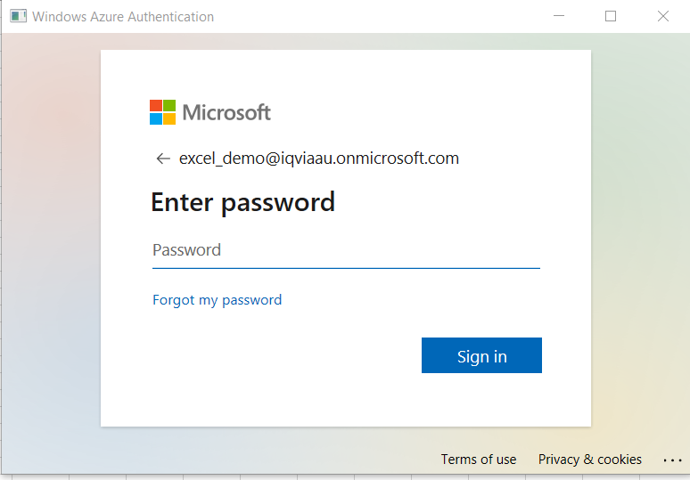

--- 
title: "The Manual of Excel Data Connector for IQVIA Semantic Data Model"
author: "AU Data Science Team"
date: 'Updated: `r Sys.Date()`'
output:
  pdf_document2: default
  bookdown::word_document2:
    toc: yes
  bookdown::html_document2: default
  bookdown::pdf_document2:
    keep_tex: yes
---
```{r setup, include=FALSE}
knitr::opts_chunk$set(echo = FALSE)
```


# How to Login?

You must install `Analyze in Excel Updates` from links provided in the Power BI service. Power BI detects the version of Excel you have on your computer, and automatically downloads the appropriate version (32-bit or 64-bit). The Power BI service runs in a browser. You can sign in to the Power BI using the following link:

* [Sign in to Power BI](https://app.powerbi.com)

If you you don't have a Power BI account, you can sign up with your own account for free from the above link. Once you've signed in and the Power BI service is running in your browser, click the down arrow in the upper-right corner and then click Analyze in Excel updates as in the Figure \@ref(fig:pbi1). This menu item applies to new installations of updates of Analyze in Excel.

```{r pbi1, fig.cap="Power BI Analyze un Excel Updates download", out.width="100%"}


```

You need to install the download on your local computer. *__If you don't have permission to install this updates, please seek help from your IT support.__*

IQVIA sill supply a preconfigured Excel workbook for you to connect to your dataset from IQVIA cloud space.

When first time the IQVIA Excel connector workbook is opened, it will display an error message same as the below:


```{r login0, fig.cap="Excel Error Message", out.width="60%"}



```

If you click OK, it will be prompted for a user name and password to log into the on cloud data service. If the prompt does not appear, please click anywhere inside the pivottable area __or close the workbook reopen it again.__

Fill in a user name as in the Figure \@ref(fig:login1):
```{r login1, fig.cap="Excel longin username propmt", out.width="80%"}



```

Fill in a password as in the Figure \@ref(fig:login2):
```{r login2, fig.cap="Excel longin password propmt", out.width="80%"}



```

