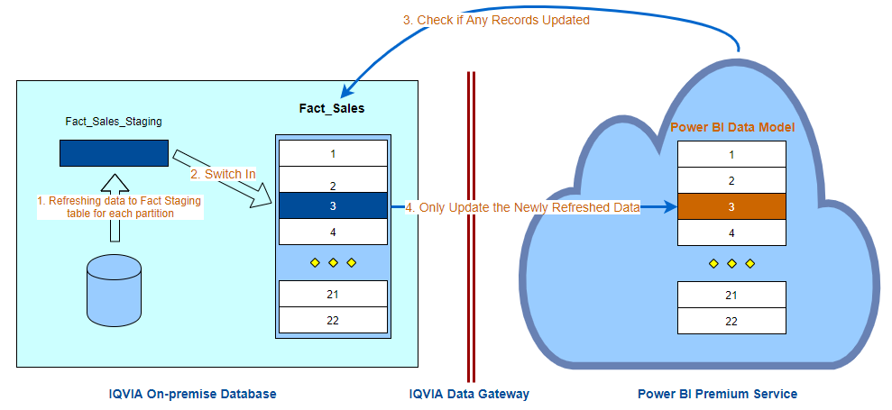

<style type="text/css">

  h2 {
  font-size: 12px;
  font-weight: normal
  font-family: Sans-serif;
  }

</style>


```{r setup, include=FALSE}
knitr::opts_chunk$set(echo = FALSE)
library(dplyr)
library(kableExtra)
library(formattable)
### SQL connection
library(odbc)
drv <- odbc::odbc()
connection <-  paste0("Driver={SQL Server Native Client 11.0};",    # Drivers
                      "Server=sydssql162d;", # Server Address
                      "Database=Product_Customization;", # Database Name
                      "Trusted_Connection=yes;")

con_odbc <- dbConnect(drv,
                      .connection_string = connection, encoding = "latin1")

connection_iqvia <-  paste0("Driver={SQL Server Native Client 11.0};",    # Drivers
                      "Server=SQLETL02D.INT.MIPORTAL.COM;", # Server Address
                      "Database=iqviaau_reporting_db;", # Database Name
                      "Trusted_Connection=yes;")

con_odbc_iqvia <- dbConnect(drv,
                      .connection_string = connection_iqvia, encoding = "latin1")

```

# Introduction

In order to meet the increasingly internal and external demanding on the self-analytic capability, AU DS team is assigned to design a semantic data model to meet this requirement.

While the initial request is based on the Bayer Consumer health sub-state data requirements, the design concept is aiming for both internal and all external client use. With this in mind, an overarching consideration of the model to meet all needs is enforced in the designing stage.


# Conceptual Data Modelling

Given that many clients share same IQVIA product master table and same retail pharmacy stores, a single physical source analytic data warehouse will be adopted instead of each client having its own database.

### The Data Model Overall Usage Flow 

Only one centralized analytic data mart will be created. A set of identical views will be used for each different client which only relevant to the client's subscription.

A standardized yet also customizable parameter-driven Power BI data model will be designed as template. 

Each client will use its views to feed into the Power BI data model to create its own Power BI workbook.

Each client's Power BI workbook will be published to its own Power BI Premium workspace.

```{r modelflow, fig.cap="Data model usage flowchart", fig.height=8, fig.width=8}
library(DiagrammeR)
mermaid("
    graph TB
    C(Centrlized Single DB)-- Create -->V1[Client 1 Views]
    C-- Create -->V2[Client 2 Views]
    C-- Create -->V4[IQVIA Views]
    V1-- Feed Data -->P(PBI Master Model)
    V2-- Feed Data -->P
    V4-- Feed Data -->P
    P-- Apply Model -->M1[Client 1 PBI]
    P-- Apply Model -->M2[Client 2 PBI]
    P-- Apply Model -->M4[IQVIA PBI]
    M1-- Publish to -->W1[Client 1 Workspace]
    M2-- Publish to -->W2[Client 2 Workspace]
    M4-- Publish to -->W4[IQVIA Workspace]
    W1-- Embedded in -->Mi(MiPortal)
    W2-- Embedded in -->Mi
    W4-- Embedded in -->Mi
    W1-. Analysing in .->U(User Tools On Premise)
    W2-. Analysing in .->U
    W4-. Analysing in .->U
    style C fill:#00b300,stroke:#333,stroke-width:4px;
    style Mi fill:#00b300,stroke:#333,stroke-width:4px;
    style P fill:#1aff1a,stroke:#333,stroke-width:2px;
    style V4 fill:#E59925;
    style M4 fill:#E59925;
    style W4 fill:#E59925;
    style U fill:#F1EA0E,stroke:#333,stroke-width:4px;
    ", height = 500, width = 700)
```


### Data Model Conceptual ERD

The conceptual ERD for the data model is proposed as the below Figure \@ref(fig:dmodel)

```{r dmodel, fig.cap="Data model design conceptual ERD"}

knitr::include_graphics("image/pbi_erd_banner_state_7.svg")

```

As Figure \@ref(fig:dmodel) shows, the model is mainly a star schema design. At brick level, we only have 1 fact table to hold the fact data. Since the fact table needs to accommodate not only the retail pharmacy data but also the Grocery and other datasets. This simplified fact table design will make some burden at the ETL side. Particularly, when some data sources which don't have same granular of data at brick or banner level, we will need a way to nominate a brick or banner to hold the upper level fact data.


Even though that a client is not supposed to view the store level data, a store level fact table is indeed also designed for 3 purpose:

1) to be used for the dynamic store distribution calculation;
2) to be made available for internal users;
3) When a client is subscribed to the probe data for Sellin;

There is no additional fact table to hold the CBG data. CBG metrics will be controlled by DAX by using context understanding the geographic level and banner selection.

# Reference Table Considerations

## IQVIA Product Master Dimension Table

IQVIA AU product master table which sourced from `warehousedata_pos_dim_product_parquet` table from BDF has more than 170 attributes. Many attributes in this master table are not interested by AU clients, particularly when it is consumer health concerned. Since the current main focus of this project is consumer healthy, most ethical related attributes are not considered for importing into the model.

### IQVIA Product Master Further Cleaning Up

The product master from BDF has still few attributes conflicting and some fundamental key indicator has not presented, like there is no simple flag to filter out the consumer health products.

In addition, that at the time of this writing which is 10th July 2020, there roughly about 4500 consumer products which have NEC classification but they don't have CHC classification. In contrast, there are also about 4500 products which have CHC code but it don't have NEC codes.

For the light PFC products, due to the nature of meaning of light PFC, the vast majority of attributes are not populated. However, some attributes which are indeed available based on other available information which are also not populated, like 

While for the master table, ideally all the changes are better fixed at the source, for the completeness of the data modelling, DS team has done some further clean-up for the master product table.

1. For the light PFC products, based on the field `pharml_mfr_co_lng_nm`, we derived and filled 2 more columns: `pharml_mfr_co_abrv_cd`, and `pharml_mfr_co_short_nm`

2. For those `pharml_mfr_co_lng_nm` not currently available in normal PFC, we set the `pharml_mfr_co_short_nm` same as `pharml_mfr_co_lng_nm`. Meanwhile, for the `pharml_mfr_co_abrv_cd` we added dummy code starting from Z001.

3. There are a large number of product which are consumer health products but they don’t have a CHC code related and currently in the BDF it leaves it blank. We used some logic to deduce the CHC code based on the NEC4 description and repopulated this blank chc code with our deduced values. The same is for those products which have CHC code but they don't have an NEC code. In order to distinguish it is DS deduced CHC value, we added this flag: `DS_Deduced`, and if the value is ‘y’ it is deduced.
    + We know this is a very coarse logic for such large volume of SKUs and some SKUs may not have any sales. For the purpose of data completeness, we coded those SKUs regardless it has sales or not. However, if production can use the same logic to review the coding and correct them then the coding time can be largely saved.

4. It is frustrating that a product master table doesn’t have a clear flag which can get just Consumer health products and the product master table attributes are quite esoteric for many end users. For the simple to filter out the consumer health product, we added this flag: `CHC_flag`, if it is ‘y’ then it is consumer health product.

5. Light PFC caused a huge issue in the reporting database side, as the vast majority of them even it is coded but it is indeed not valuable for the reporting purpose. We created a Flag: `NEC_Other_no_CHC`, for those product which may not that useful, we may can group them together at the manufacturer level while reporting.

6. Should we have a flag for those LightPFCs which need to be reported as clients have identified them? If this is the case, then we can group the lightPFC products to its manufacturer and/or CHC code if they have. This can be largely reduce the product master table and fact table size. There are 490K PFCs at this moment with LightPFC. Meanwhile, it has 110K products if we don't count LightPFC. If we can group some lightPFC together for the revenue completeness purpose, then the data size can be largely reduced


### IQVIA Product Master Attributes Used

Not all IQVIA product master attributes will be brought into this model, we currently only bring in the attributes most relevant to consumer health related. This can be expanded in the future if needed. For this exercise, we indeed linked CWH rate category into the master table. This can be done at BDF side in the future. Table \@ref(tab:piqvia) shows attributes we will use for our IQVIA product master in the data model and its proper descriptive names.

```{sql piqvia, connection = con_odbc, echo = FALSE, max.print = -1, tab.cap = "Product IQVIA Master View Column Definition"}

SELECT [attribute_name]
      ,[attribute_name_use] As attribute_name_display
      ,IsNUll([description], '') As description
FROM [dbo].[pbi_Product_Attributes_IQVIA];

```

## Client Product Master Dimension Table

IQVIA has a client territory and product segmentation customization tool: Everest, this tool has given the client great flexibility to customize the product attributes associated with each different product category. In contrast, this flexibility also caused some issue for the downwards reporting side maintenance issue.

For this semantic data model, each client has its own client product dimension table. For the model standardization point of View, the model will use a fixed number of standardized client product attributes. In order to standardize the client product table attributes, DS team has done such:

1) Get all currently available client product attributes;

2) Use fuzzy grouping to map the similar attributes to a master attributes name;

3) Save this raw attributes name to master attributes name to a master attributes lookup table. 
    + When the new attributes added in client attributes, this table will get updated.

4) For each client, each category it will have its own sets of product attributes, some are the same and some are not.
    + DS will create a unified client product table: ClientName_AllCategories to accommodate all categories
    + If some attributes is not available for some categories, then NULL value will be used.

5) DS team has created an process to create the client product master view.
    + All client product master view will have the exactly same attributes
    + Underneath the display attribute names, each attribute is mapped to its proper client product attributes used via attributes mapping table
    + In the model side, only the attributes which are relevant to a client are displayed

The Table \@ref(tab:pclient) below depicts client attributes used for client product master and the standardized view column definition. The SQL code shows how this view columns are generated.

```{sql pclient, connection = con_odbc, echo = TRUE, max.print = -1, tab.cap = "Product Client View Column Definition"}

with cte
as
(
  Select Distinct B.Name
  From 
  sys.tables A
	Inner Join
  sys.all_columns B
	On A.object_id = B.object_id
  Where A.name = 'Blackmores_AllCategories'
)
,cte2
as
(
SELECT [attribute_name]
		,B.name
      ,[keep_attribute]
      ,[attribute_name_use]
      ,[sort_order]
	  ,Case When [attribute_name] = 'fcc' Then ',fcc' 
	  when quotename(name) is null then ',Null'
	  Else ',' + quotename([attribute_name]) End 
	  + ' As ' + quotename([attribute_name_use]) as view_columns
	  ,row_number() over(partition by attribute_name_use order by name desc) as rw
  FROM [dbo].[pbi_Product_Attributes_Master] A
  Left outer join
  cte B
  on A.attribute_name = B.name
  Where A.keep_attribute = 1
  )

  Select view_columns
  , isnull(name,'') as client_columns
  , sort_order
  , case when name is not null or [attribute_name] = 'fcc' then 1 else 0 end as column_display
  from cte2
  Where rw = 1
  order by sort_order;

```

## Brick Dimension Table

The Brick dimension table is designed to take care of all potential brick structure which is above IQVIA retail brick. There are currently potentially 3 different brick structure could be implemented:

* Retail Brick: can be used for Sellin data, typically around 1040 bricks
* Scan Brick: this is the new brick structure still in developing and evaluation. This structure is meant to be used for Scanout data with the lowest reportable geo-spatial structure. Ideally, the retail brick should be rolled up to scan brick.
* CHW brick: this is the brick structure to protect the chemist warehouse store privacy. Retail bricks are rolled up to CWH Bricks. Ideally, the scan brick can be also rolled up to CWH brick

In the ideal scenario, the brick structure is hierarchical from retail brick to scan brick to CWH brick. For the future prove and in the case of these structure is not hierarchical, a `brick_structure_base` attribute is added into the Brick dimension table. The brick structure base can be: retail brick, scan brick, or CWH brick. If the fact data is available, it can be extended to other geo-structure base as well, like ABS LGA, SA2, SA3 etc.

The Table \@ref(tab:sqbrick) below depicts the attributes used for the `dim_brick` table.

```{sql sqbrick, connection = con_odbc, echo = FALSE, max.print = -1, tab.cap = "Brick Dimension Table Columns"}

SELECT [Brick_Attributes_Name]
      ,IsNull([Description], '') As [Description]
FROM [dbo].[pbi_Brick_Attributes];

```


### Ideal Brick Rollup Structure

Ideally, all brick structure used should be roll up to any client territory. When a brick structure is in line with a client territory structure it is most valuable for client reporting purpose. Figure 
@ref(fig:brickhr) depicts the ideal brick rollup hierarchy structure. 

```{r brickhr, fig.cap="IQVIA Brick Hierarchy Structure Options", fig.height=8, fig.width=8}
library(DiagrammeR)
mermaid("
    graph TD
    RB[Retail Brick]-->SB[Scan Brick]
    SB-->CB[CWH Brick]
    CB--Option 1: Ideal Structure <p> may not practical-->CT(Client Territory)
    RB-.Option 4:<p>Retail Brick to Territory.->CT
    SB-.Option 3:<p>RB to SB to Territory.->CT
    SB1[Scan Brick.] -.Option 2:<p>Scan Brick to Territory.->CT
    CT-->SG[State Group]
    SG-->AU((National))
    style RB fill:#00b300,stroke:#333,stroke-width:4px;
    style SB fill:#00ffff,stroke:#333,stroke-width:2px;
    style SB1 fill:#00ffff,stroke:#333,stroke-width:4px;
    style CB fill:#99ccff,stroke:#333,stroke-width:2px;
    style CT fill:#f96,color:#fff,stroke:#333,stroke-width:2px;
    style SG fill:#99cc00,stroke:#333,stroke-width:2px;
    style AU fill:#F1EA0E,stroke:#333,stroke-width:4px;
    ", height = 700, width = 700)
```

Unfortunately, this was not always the case for our current CWH bricks to client territories. 

### CWH Brick as the Lowest Granular Structure

Since currently the lowest reportable scanout geography which has been evaluated by stats office is CWH brick, the Figure \@ref(fig:cwbrickhr) will be implemented. Within the each CWH brick only 2 banner groups will be reported:

* Chemist warehouse banner group: Chemist warehouse, My Chemist, Beauty spot
* Other Banners: All other banners other than CWH group

At the state level, all state reportable banners can be reported. 

```{r cwbrickhr, fig.cap="Current implementation of CWH Brick to State Group", fig.height=8, fig.width=8}
library(DiagrammeR)

mermaid("
    graph LR
    CB[CWH Brick]-->SG[State Group]
    SG-->AU((National))
    subgraph Brick_Reportable_Banners
    B1[CWH Group]
    B2[All Other Banners]
    end
    subgraph State_Reportable_Banners
    RB[All Reportable Banners]
    end
    CB-.->B1
    CB-.->B2
    SG-.->RB
    style CB fill:#99ccff,stroke:#333,stroke-width:4px;
    style SG fill:#99cc00,stroke:#333,stroke-width:2px;
    style AU fill:#F1EA0E,stroke:#333,stroke-width:4px;
    ", height = 350, width = 700)

```

With this implementation, The Brick dimension key: Brick_ID, will be same as CWH_Brick_ID. Brick_Name, Scan_Brick_ID, and Scan_Brick_Name will be blank or null value.

## Chanel Dimension Table

Channel dimension table is a very simple table to distinguish if a banner is Retail or Grocery. 


## Banner Dimension Table

Banner Dimension has a `channel` attribute to distinguish: retail pharmacy and grocery. DS team has added some additional attributes into the Banner dimension table. These attributes can be reviewed and incorporate into BDF master table. `Is_Banner_Client_Reportable` refers to client subscription to specific banners. This attributes is only useful for client not useful for the internal user. The attributes therefore is client specific. For simplicity, there is no link between banner to client module. The attributes value is populated during the client ETL stage.

A certain banners, IQVIA doesn't have enough panel stores to make the banner reportable. These banners include:

* Priceline
  + Priceline Pharmacy
  + Priceline Health & Beauty
* Good Price Pharmacy
* National Pharmacies

For these banners, if a client bought the data from other source then we can integrate them into our data and make these banner reportable. The last 3 invisible attributes are used to indicate if such banner is reportable.

The Table \@ref(tab:sqbanner) below depicts the attributes used for the `dim_banner` table.

```{sql sqbanner, connection = con_odbc, echo = FALSE, max.print = -1, tab.cap = "Banner Dimension Table Columns"}

SELECT [banner_Attributes]
      ,[Description]
      ,[Client_Display]
FROM [dbo].[pbi_Banner_Attributes];

```

Given that, not all banners are reportable at a specific state level, from banner to fact table there is a transition dimension table banner state.

When there is not enough panel stores in a state for a reportable banner at a particular period, the state will group to Other States. Since our Scanout data projection has made a major overhaul. The new projection can project data down to Store + FCC level. 

### Banner State Dimension Table

Banner state Dimmesion table is used for client for banner reporting. Due to a reportable banner state changes based on the different time period, to report the banner state related sales data, the banner state attributes in this table have to be used. **_This means a combined attributes from Banner table and State table, will not yield the same results as the same combination in this table!_**

```{sql sqbannerS, connection = con_odbc, echo = FALSE, max.print = -1, tab.cap = "Banner State Dimension Table Columns"}

SELECT [Banner_State_Attributes]
      ,IsNull([Description], '') As [Description]
      ,[Client_Display]
FROM [dbo].[pbi_Banner_State_Attributes];

```

Due to the complexity of IRI pannel banner data, like Priceline & Good price pharmacy. Some SKUs which is calculated in IQVIA projected sales data may not included in the IRI supplied data for a particular client for various reasons, like an SKU is not included in a client's market definition. For this reason, those SKUs which are not included in IRI data based on a client definition will need to assign to Other banner Other states for the overall sales completeness. we created a dummy banner state code to hold this data. At the reporting stage, based on the reportable banner state attributes, it will all go to the Other banner Other states. 

This dummy record is illustrated as in the table \@ref(tab:btdummy) below:

```{sql sqbtdummy, connection = con_odbc_iqvia, echo = FALSE, max.print = -1, output.var="d_btdummy"}

SELECT *
FROM [dbo].[dim_banner_state]
Where banner_state_id = -999;
```

```{r btdummy}

df <- t(d_btdummy) %>% data.frame(stringsAsFactors = F)

names <- rownames(df)
rownames(df) <- NULL
df <- cbind(names, df)

names(df) <- c("Attribute_Name", "Date_Value_Example")

# knitr::kable(df, caption = "Dim Banner State Dummy Code")
df %>% 
 mutate(
    Date_Value_Example = cell_spec(Date_Value_Example, "html", color = ifelse(Attribute_Name == "banner_state_id", "red", "black"))
  ) %>%
  kable(format = "html", escape = F, caption = "Dim Banner State Dummy Code") %>%
    footnote(general = "The integer -999 is a hardcoded number to capture all sales records which are not presented in IRI datasets.",
           fixed_small_size = TRUE
           )

```


## Date(Period) Dimension Table

Date dimension table is a key dimension table for all reporting, as most sales reporting needs time intelligence.

In this data model, monthly and weekly fact data will be combined in the same fact table. Therefore, the monthly and weekly date will be combined in the same dimension table.

For a client, when a period name is not specified and there is no date attributes included, a default period name will be used to display measures at the latest date. The default period name is a configurable value for each client, which can be one of all available period names. This means one client may use MAT while the another may use MQT.

The Figure \@ref(fig:ptype) below depicts Date dimension table period types and all available period names and its rollup path.

```{r ptype, layout="l-screen-insert", fig.cap="Date Period Type and its Rollup Hierarchy"}

knitr::include_graphics("image/period_type.jpg")

```

### Period Type and Period Name Configuration Table

A global period name configuration table will add into our data model data warehouse to centrally control the available period name and its periods covered as in the table below:

This table will be used as a reference table to generate the Date Dimension table attributes as described in the section of Date Dimension table. Table \@ref(tab:pconfig) depicts the currently used period names and its configuration values.

```{sql sqpconfig, connection = con_odbc_iqvia, echo = FALSE, max.print = -1, output.var="p_config"}

SELECT [Period_Type]
      ,[Period_Name]
      ,[Periods]
      ,[Period_Short_Name]
FROM [dbo].[Admin_Config_Period_All];
```

```{r pconfig}

p_config %>%
  mutate(
    Period_Name = cell_spec(Period_Name, "html", color = ifelse(Periods < 0, "red", "darkblue")),
    Periods = cell_spec(Periods, "html", color = ifelse(Periods < 0, "red", "darkblue"))
  ) %>%
  kable(format = "html", escape = F, caption = "Period Name Configuration Table") %>% 
    footnote(general = "Periods attribute is the number of reoccuring periods covered in a period name. ",
           number = c("Negative value means there is really no fixed periods; ", "YTD, Calendar Year, Calendar Quarter, YTD Weeks change number of periods at each diffrerent date so using negative values; ",
                      "There is no particular meaning for the value of negative pe se it is just used to distinguish period names;"),
           fixed_small_size = TRUE
           )

```


Given that the different period names has different descriptive names and other attributes values, two date dimension tables will be created:

* Date_Base dimension table: this one is directly linked to Fact table to form a one to many relationship. The dimension table is invisible to end users.
* Date Dimension table: based on the hierarchy structure depicted in the figure \@ref(fig:ptype), the lowest date unit weekly or monthly will be replicated in many period name hierarchy. The Date dimension table and Date_Base table is many to one relationship.


### Date Dimension Key Consideration


It is a good practice to use a meaningful key as data surrogate key, this can reduce the time to infer the meaning of date key in the fact table. The data surrogate key is integer data type, we define the data surrogate key as below convention:

__`YYYYMMDDXZ`__

Where the last 2 digits X and Z are period Starting/Ending and period type indicator:

* For X
    + if the date is using a period starting date, then X = 0;
    + if the date is using a period ending date, then X = 1
* For Z
    + if the period type is `Monthly`, then Z = 1;
    + if the period type is `Weekly`, then Z = 2

Examples:

* 2018050101 this stands for the date if a monthly date, and using the month start date $1^{st} May\:2018$;
* 2020071812 this stands for the date is a weekly date, and using the week end date $18^{th} July\:2020$


### Date Base Table

Date base dimension table is very simple and it only has 4 columns. The table columns and its value examples is as in Table \@ref(tab:dbase) as below:

```{sql sqDbase, connection = con_odbc_iqvia, echo = FALSE, max.print = -1, output.var="d_base"}

SELECT top (1)[period_id]
      ,[period_base]
      ,[period_start]
      ,[period_end]
FROM [dbo].[dim_date_base];
```

```{r dbase}
df <- t(d_base) %>% data.frame()

names <- rownames(df)
rownames(df) <- NULL
df <- cbind(names,df)

names(df) <- c("Attribute Name", "Date Value Example")

knitr::kable(df, caption = "Date Base Dimension Table Columns")

```


### Date Dimension Table {#CDimDate}


Date dimension table columns and its value examples is as in Table \@ref(tab:ddim) as below:

```{sql sqDDim, connection = con_odbc_iqvia, echo = FALSE, max.print = -1, output.var="d_date"}

SELECT TOP (3) *
FROM [dbo].[vw_Dim_Date]
Order by newid();
```

```{r ddim}
df <- t(d_date) %>% data.frame()

names <- rownames(df)
rownames(df) <- NULL
df <- cbind(names, df)

names(df) <- c("Attribute Name", "Value Example 1", "Value Example 2", "Value Example 3")

knitr::kable(df, caption = "Date Dimension Table Columns")

```

### Client Discrete Date Reporting

Some clients have a set of special dates or frequencies to be reported. There are a couple of ways to implement this. The actual implementation will be added later.


## Sellin_Scanout Dimension Table

This is a very simple dimension table to separate the fact data into Sellin/Scanout, Monthly/Weekly, and Calendar Year partition combinations. 

To separate the Sellin/Scanout, Monthly/Weekly, and Calendar Year combinations into different partitions in the fact table renders the different frequency of updates of the fact data possible. This means we can update sellin/scanout and monthly/weekly data in the same fact table at the different cadence without reloading everything. This can save a significant data reloading time and make the Power BI service incremental refreshing possible. Table \@ref(tab:sqsiso) dipects more details about this table.


## Store Dimension Table

The store dimension table is built for calculating the store distribution metrics and also for the internal data analysis use. This dimension table will be visible for internal users but it will be hidden for the external clients. However, if a client is subscribed to IQVIA store level data, then this table can be set to visible to a client as well.

DS team has made effort to include many ABS geospatial attributes namely:

- LGA, local government area;
- SUA, significant urban area;
- GCCSA, Greater Capital City Statistical Area;
- SA1, ABS statistical area level 1
- SA2, ABS statistical area level 2
- SA3, ABS statistical area level 3
- SA4, ABS statistical area level 4


It will be great that these attributes can also be added into the Outlet master table. 

Store dimension table columns and its value examples is as in Table \@ref(tab:dstore) as below:

```{sql sqDStore, connection = con_odbc_iqvia, echo = FALSE, max.print = -1, output.var="d_store"}

SELECT TOP (2) *
FROM [dbo].[dim_store]
Order by newid();
```

```{r dstore}
df <- t(d_store) %>% data.frame()

names <- rownames(df)
rownames(df) <- NULL
df <- cbind(names, df)

names(df) <- c("Attribute Name", "Value Example 1", "Value Example 2")

knitr::kable(df, caption = "Store Dimension Table Columns")

```

### Grocery Store Consideration

While we currently don't have the grocery store level information, the store table is designed to incorporate the grocery store as well. However, there is no such information currently.


## Store Banner Period Table

Since a store's banner association is time related, a store may change its banner association over time. The dim_store_banner_period dimension table is a transition table to hold such information. It is also a semi-fact table as it can count the banner and/or banner state store members over time. Three key is sufficient to populate this table. However, for the pre-Power BI load ETL process purpose, there are additional attributes included in this table for look-up dimension key purpose.


```{sql sqsbanner, connection = con_odbc, echo = FALSE, max.print = -1, tab.cap = "Store Banner State Dimension Table Columns"}

SELECT [Store_Banner_Attributes]
      ,[Description]
      ,[Client_Display]
FROM [dbo].[pbi_Store_Banner_State];

```


This the example record of dim_store_banner_state table is illustrated as in the table \@ref(tab:storebs) below:

```{sql sqstorebs, connection = con_odbc_iqvia, echo = FALSE, max.print = -1, output.var="d_storebs"}

SELECT top (1) *
FROM [dbo].[dim_store_banner_state];
```

```{r storebs}

df <- t(d_storebs) %>% data.frame(stringsAsFactors = F)

names <- rownames(df)
rownames(df) <- NULL
df <- cbind(names, df)

names(df) <- c("Attribute_Name", "Date_Value_Example")

knitr::kable(df, caption = "Dim Store Banner State REcord Example")
# df %>% 
#  mutate(
#     Date_Value_Example = cell_spec(Date_Value_Example, "html", color = ifelse(Attribute_Name == "banner_state_id", "red", "black"))
#   ) %>%
#   kable(format = "html", escape = F, caption = "Dim Banner State Dummy Code") %>%
#     footnote(general = "The integer -999 is a hardcoded number to capture all sales records which are not presented in IRI datasets.",
#            fixed_small_size = TRUE
#            )

```

# Client Specific Dimension Tables

As the semantic database is designed to share the fact table for all clients, there are a certain dimension tables are shared by all clients and some dimension tables for each client the contents are different.

The dimension tables which are shared by all clients are:

* Dim_Store
* Dim_Banner_Store_Period
* Dim_Channel 
* Dim_Banner
* Dim_Banner_State
* Dim_State
* Dim_Brick
* Dim_Product (Before feeding to PBI Model, the client Dim_Product view will be created and the products are limited by the Dim_Product_Client)
* Dim_Date_Base (Before feeding to PBI Model, the client Dim_Date_Base view will be created and the Dates are limited by the Dim_Date_Client)
* Dim_Sellin_Scanout (Before feeding to PBI Model, the client Dim_Sellin_Scanout view will be created and the records are limited by number of years client subscribed to)


The dimension tables which are client specific are:


* Dim_Product_Client
* Dim_Date_Client
* All other dimension tables in the client module

The configuration tables which are client specific are:

* Admin_Config_Period
* Admin_Config_Banner


## Client Specific Dimension Table Name convention


For consistency and grouping the same client tables together reasons, all client specific tables are named with below name convension:

ClientName_DimensionTableName


# Fact Table Design Considerations

These Semantic data model only have 3 fact tables:

1. fact_Brick_Banner_Sales: this fact table stores the brick banner lever of sales data. The sales data is loaded with the below configuration:
    + Row-wise:
        + Monthly
        + Weekly
        + Sellin
        + Scanout
        + Channel (Retail, Grocery etc.)
    + Column-wise:
        + Amount
        + Unit
        + Baseline Amount
        + Baseline Unit
        + Promotion Amount
        + Promotion Unit
        + Export Amount
        + Export Unit
        + Online Amount (Will not be reported at brick level but state or national level. CWH is separable At national level)
        + Online Unit (Will not be reported at brick level but state or national level. CWH is separable At national level)
        
2. fact_store_sales: this fact table stores the store lever of sales data. The sales data is loaded with the below configuration:
    + Row-wise:
        + Monthly
        + Weekly
        + Sellin
        + Scanout
        + Channel (Retail, Grocery etc.)
    + Column-wise:
        + Amount
        + Unit
        + Baseline Amount
        + Baseline Unit
        + Promotion Amount
        + Promotion Unit
        + Export Amount
        + Export Unit
    + Online sales will need to create dummy store to hold all Non-CWH online sales at state level
        
    
3. fact_iri_grocery_distribuion: more info to be added later


## Storage Consideration

Given that the fact table used in this semantic model will have consolidated data, the data size for these fact tables will be huge. We used the different file groups and data files to hold the fact table. 2 filegroups were created for this purpose:

* fg_Fact_Data: to hold the fact brick banner level data
* fg_Fact_Store: to hold the fact store level data and distribution data


```{sql sqlFilegroup, connection = con_odbc_iqvia, echo = TRUE, eval = FALSE}

--create a new database file group
ALTER DATABASE [iqviaau_reporting_db] ADD FILEGROUP [fg_Fact_Data];
ALTER DATABASE [iqviaau_reporting_db] ADD FILEGROUP [fg_Fact_Store];


--Add new data file for fact brick sales to the new file group
ALTER DATABASE [iqviaau_reporting_db]
    ADD FILE 
    (
    NAME = [iqviaau_reporting_db_fb],
    FILENAME = 'd:\Program Files\Microsoft SQL Server\MSSQL13.MSSQLSERVER\MSSQL\DATA\iqviaau_reporting_db_fact_fb.ndf',
        SIZE = 5120 MB, 
        MAXSIZE = UNLIMITED, 
        FILEGROWTH = 1024 MB
    ) TO FILEGROUP [fg_Fact_Data];

--Add new data file for fact brick sales to the new file group
ALTER DATABASE [iqviaau_reporting_db]
    ADD FILE 
    (
    NAME = [iqviaau_reporting_db_fs],
    FILENAME = 'd:\Program Files\Microsoft SQL Server\MSSQL13.MSSQLSERVER\MSSQL\DATA\iqviaau_reporting_db_fact_fs.ndf',
        SIZE = 5120 MB, 
        MAXSIZE = UNLIMITED, 
        FILEGROWTH = 1024 MB
    ) TO FILEGROUP [fg_Fact_Store];

-- create table partition function

CREATE PARTITION FUNCTION [func_salesPart](int) 
AS RANGE LEFT FOR VALUES (101, 102, 103, 104, 105, 106, 201, 202, 203, 204, 205, 206, 301, 302, 303, 304, 305, 401, 402, 403, 404, 405)

--Create Partition scheme
CREATE PARTITION SCHEME [sch_brickSalesPart] AS PARTITION [func_salesPart] All TO ([fg_Fact_Data]);
CREATE PARTITION SCHEME [sch_storeSalesPart] AS PARTITION [func_salesPart] All TO ([fg_Fact_Store]);

```

Since the row-wise data of the fact table have different update frequency, fact tables are partitioned to take care of the incremental data update for different table partitions. By this design, 6 years of monthly data and 5 years of weekly data will be load into the fact table. The fact tables were partitioned into 22 different partitions based on the following partition keys. Table \@ref(tab:sqsiso) lists all 22 partition keys and ite related attributes.

```{sql sqsiso, connection = con_odbc_iqvia, echo = FALSE, max.print = -1, tab.cap = "Fact Table Partition Keys and its Related Attributes"}

SELECT
[partition_key]
,[sales_type]
,[period_type]
,[period_year]
FROM [dbo].[vw_Dim_Sellin_Scanout];

```

## IRI Data Integration

A certain banners, IQVIA doesn't have enough panel stores to make the banner reportable. Currently, these banners include:

* Priceline
* Good Price Pharmacy
* National Pharmacies

For these banners, if a client bought the data from other source then we can integrate them into our data and make these banner reportable. Normally, the granular of geography of these banners from IRI is at the state level. This data granular difference has added the data process complexity to integrate the IRI data into our fact table. We will need a process to reverse engineering the data down from state to our brick level. Moreover, there are more complex on the Priceline data, as Priceline data from IRI has a specific start data as in the below table \@ref(tab:sqiripl):

```{sql sqiripl, connection = con_odbc_iqvia, echo = FALSE, max.print = -1, tab.cap = "IRI Priceline data Period Start Date"}

SELECT [banner_id]
,[period_type]
,[period_start]
FROM [dbo].[Admin_Config_IRI_All]
Where [banner_id] = 'Priceline';

```

The diagram \@ref(fig:iriprocess) shows the overall process flow of IQVIA and IRI data integration.

```{r iriprocess, fig.cap="IRI Data Brick Level Data REEngineering flowchart", , fig.height=13.5, fig.width=6}
library(DiagrammeR)
mermaid("
    graph TB
    A((IQVIA <p> Data))-- Non-IRI Panel -->B[NIP Data]
    A-- IRI Panel Only -->C[IPO Data]
    C-- No IRI Data -->D[IPO ALL IQVIA]
    D-- Set IPO Baner <p> State ID to -999 -->E[IPO IQVIA Other]
    C-- Has IRI Data -->F[IPO IQVIA + IRI]
    G((IRI Data))-->F
    F-->H>Apply IRI <p> Data Process]
    H-- Product not in IRI -->I[IPO IQVIA Projected]
    H-- Propduct in IRI -->J[IPO_IRI]
    J-- Brick Value Allocation --> O[IPO_IRI Brick]
    I-- Set IPO Baner <p> State ID to -999 -->K[IPO Other]
    O-->L[IPO_Combined]
    K-->L
    E-.->M>Pick the Data based <p> on IRI Subscription]
    L-.->M
    B-->N(IQVIA & IRI Integrated Data)
    M-->N
 
    style A fill:#0EC8F1,stroke:#333,stroke-width:4px;
    style B fill:#0EC8F1,stroke:#333,stroke-width:2px;
    style C fill:#0EC8F1,stroke:#333,stroke-width:4px;
    style D fill:#0EF1EE;
    style E fill:#0EF1EE;
    style F fill:#0EF1EE;
    style G fill:#F18D0E,stroke:#333,stroke-width:4px;
    style H fill:#F1EA0E,stroke:#333,stroke-width:2px;
    style I fill:#0EF1EE,stroke:#333,stroke-width:2px;
    style J fill:#F18D0E,stroke:#333,stroke-width:2px;
    style K fill:#0EF1EE,stroke:#333,stroke-width:2px;
    style L fill:#F18D0E,stroke:#333,stroke-width:2px;
    style M fill:#F18D0E,stroke:#333,stroke-width:2px;
    style O fill:#F18D0E,stroke:#333,stroke-width:2px;
    style N fill:#0EC8F1,stroke:#333,stroke-width:4px;
    ", height = 850, width = 500)
```


### IRI Brick Level Data Allocation Logic

IRI sales data is fed at banner state level. It has the different granular of geography with IQVIA data. A reverse engineering process is established to reallocate banner state level sales data down to banner brick level as in the flow chart Figure \@ref(fig:irireverse):

```{r irireverse, fig.cap="IRI Data Brick Level Data Reengineering flowchart", , fig.height=13, fig.width=6}
library(DiagrammeR)
mermaid("
    graph TB
    A((IRI <p> Data))-- Get Banner_State+FCC -->B[IRI Unique BS + FCC]
    C(IQVIA Data IB)-- Inner Join -->B
    B-- Calc. MAT Brick <p> FCC Contr.% -->D[MAT, BS+FCC <p> Contr. %, Brick Count]
    B-- Calc. MAT Brick <p> CHC3 Contr.% -->E[MAT, BS+CHC3 <p> Contr. %,Brick Count]
    B-- Calc. MAT Brick <p> Tot Cat Contr.% -->F[MAT, BS+Tot. Cat. <p> Contr. %,Brick Count]
    D-->G{FCC Brick <p> Count}
    E-->H
    F-->I
    G-- If <= 3 -->H{CHC3 Brick <p> Count}
    G-. If > 3 .->J[Use the Contri %]
    H-. if > 3 .->J
    H-- If <= 3 -->I{Tot. Cat <p> Brick Count}
    I-. If > 3 .-J
    A-- Apply the Brick Ratio -->J
    J-- Apply Ratio on State Value -->K(IRI Brick Data)
 
    style A fill:#F18D0E,stroke:#333,stroke-width:4px;
    style B fill:#F1C80E,stroke:#333,stroke-width:2px;
    style C fill:#0EC8F1,stroke:#333,stroke-width:4px;
    style D fill:#0EF1EE;
    style E fill:#0EF1EE;
    style F fill:#0EF1EE;
    style G fill:#F1EA0E,stroke:#333,stroke-width:2px;
    style H fill:#F1EA0E,stroke:#333,stroke-width:2px;
    style I fill:#F1EA0E,stroke:#333,stroke-width:2px;
    style J fill:#1aff1a,stroke:#333,stroke-width:2px;
    style K fill:#F18D0E,stroke:#333,stroke-width:4px;
    ", height = 800, width = 500)
```

### IRI Priceline Data Process Consideration

There are a certain rules enforced to take care of the IRI Priceline data integration:

1. **If using IRI Priceline data (when a client purchased from IRI)**
    + All IQVIA Priceline data before the period cutoff date will be used for the reporting. All IQVIA projected data after the period cutoff date will be discarded.
    + For all products in IRI Priceline commodity definition
        + if the sales exists in IQVIA projected data before the period cutoff date, then the IQVIA data will be kept as Priceline banner sales.
        + if there are products which are not presented in the IRI commodity definition but there are sales captured in IQVIA data, then the banner state id of all such records will be reset to our catch all 'Other Banner Other States', currently it is a value of -999.
        
This process sequence is depicted as in the Figure \@ref(fig:iriintseq).        
        
```{r iriintseq, layout="l-screen-insert", fig.cap="Data model usage flowchart", fig.height=6}
library(DiagrammeR)
mermaid("
sequenceDiagram
  participant A as Start Date
  participant B as PL Data Cutoff Date
  participant C as End Date
  A->>B:IQVIA PL Data
  B->>C:IRI PL Data
  Note right of B: IRI PL Data
  B->>C: Apply Brick Sales Allocation logic
  B->>C:Get the list of IRI Products
  B-->>C:Check IQVIA Projected PL Data
  B-->>C:Drop product Sales already in IRI
  B-->>C: Change Banner State to Other for SKUs Not in IRI
  Note right of B: IQVIA Other Banner
  Note right of A: IQVIA PL Data
  B->>A: Keep Sales for any SKUs in IRI definition
  B->>A: Change Banner State to Other for SKUs Not in IRI
  Note right of A: IQVIA PL Data
  Note right of A: IQVIA Other Banner
")
```       
  
  <!-- B->>C: Drop IQVIA Data -->
  
        
2. **If using IQVIA Priceline data (when a client didn't purchase from IRI)**
    + Priceline banner will not be reported as an individual banner.
    + All Priceline banner sales will go to 'Other Banner Other States' bucket
        

## Brick Banner Level Sales Fact Table

### Data Refresh Strategy

Fact table data is updated based on each partition. A partition is like a table. We have predesigned the fact table to use 22 partitions based on the current requirement.

Fact table is not directly updated. Instead, we created fact staging table which has an exactly same table schema as fact table. We load each partition data into the staging fact table then we can simply switch in the table into the Fact table partition. This approach has many benefits. Not only each partition can be updated separately, but also it improved the data refresh efficiency and reduce the process time. The diagram \@ref(fig:incref) illustrates this strategy.


```{r incref, layout="l-screen-insert", fig.cap="Incremental Data Refresh Illustration"}



```

### Table partition

```{sql sqlFactBrick, connection = con_odbc_iqvia, echo = TRUE, eval = FALSE}

-- Create fact banner brick sales table for non-IRI panel banners (IQVIA Banner only)
CREATE TABLE [dbo].[fact_banner_brick_sales_nip] (
	[partition_key] [int] Not Null,
	[banner_state_id] [int] Not Null,
	[brick_id] [int] not Null,
	[period_id] [int] Not NULL,
	[fcc] [int] Not NULL,
	[amount] [bigint] NULL,
	[unit] [bigint] NULL,
	[baseline_sales_amount] [bigint] NULL,
	[baseline_sales_unit] [bigint] NULL,
	[promotion_sales_amount] [bigint] NULL,
	[promotion_sales_unit] [bigint] NULL,
	[export_amount] [bigint] NULL,
	[export_unit] [bigint] NULL,
	[online_amount] [bigint] NULL,
	[online_unit] [bigint] NULL
) ON [sch_brickSalesPart] (partition_key);

go

CREATE CLUSTERED COLUMNSTORE INDEX [cci_fact_banner_brick_sales_nip] ON [dbo].[fact_banner_brick_sales_nip] 
WITH (DROP_EXISTING = OFF, COMPRESSION_DELAY = 0) ON [sch_brickSalesPart] (partition_key);

go
-- Create fact banner brick sales staging table for non-IRI panel banners (IQVIA Banner only)
CREATE TABLE [dbo].[fact_banner_brick_sales_nip_stage] (
	[partition_key] [int] Not Null,
	[banner_state_id] [int] Not Null,
	[brick_id] [int] not Null,
	[period_id] [int] Not NULL,
	[fcc] [int] Not NULL,
	[amount] [bigint] NULL,
	[unit] [bigint] NULL,
	[baseline_sales_amount] [bigint] NULL,
	[baseline_sales_unit] [bigint] NULL,
	[promotion_sales_amount] [bigint] NULL,
	[promotion_sales_unit] [bigint] NULL,
	[export_amount] [bigint] NULL,
	[export_unit] [bigint] NULL,
	[online_amount] [bigint] NULL,
	[online_unit] [bigint] NULL
) ON [fg_Fact_Data];

GO

ALTER TABLE [dbo].[fact_banner_brick_sales_nip_stage]  WITH CHECK ADD  CONSTRAINT [chkBBPartID] CHECK  (partition_key > 100 AND partition_key <= 101);

GO

ALTER TABLE [dbo].[fact_banner_brick_sales_nip_stage] CHECK CONSTRAINT [chkBBPartID];

GO

CREATE CLUSTERED COLUMNSTORE INDEX [cci_fact_banner_brick_sales_nip_stage] ON [dbo].[fact_banner_brick_sales_nip_stage] 
WITH (DROP_EXISTING = OFF, COMPRESSION_DELAY = 0) ON [fg_Fact_Data];

--ALTER TABLE [dbo].[fact_banner_brick_sales_nip_stage]  DROP CONSTRAINT if exists [chkBBPartID];
--DROP INDEX IF Exists [cci_fact_banner_brick_sales_nip_stage] ON [dbo].[fact_banner_brick_sales_nip_stage];

```


```{sql sqlFactStore, connection = con_odbc_iqvia, echo = TRUE, eval = FALSE}

-- Create fact banner brick sales table for non-IRI panel banners (IQVIA Banner only)
CREATE TABLE [dbo].[fact_banner_brick_sales_nip] (
	[partition_key] [int] Not Null,
	[banner_state_id] [int] Not Null,
	[brick_id] [int] not Null,
	[period_id] [int] Not NULL,
	[fcc] [int] Not NULL,
	[amount] [bigint] NULL,
	[unit] [bigint] NULL,
	[baseline_sales_amount] [bigint] NULL,
	[baseline_sales_unit] [bigint] NULL,
	[promotion_sales_amount] [bigint] NULL,
	[promotion_sales_unit] [bigint] NULL,
	[export_amount] [bigint] NULL,
	[export_unit] [bigint] NULL,
	[online_amount] [bigint] NULL,
	[online_unit] [bigint] NULL
) ON [sch_brickSalesPart] (partition_key);

go

CREATE CLUSTERED COLUMNSTORE INDEX [cci_fact_banner_brick_sales_nip] ON [dbo].[fact_banner_brick_sales_nip] 
WITH (DROP_EXISTING = OFF, COMPRESSION_DELAY = 0) ON [sch_brickSalesPart] (partition_key);

go
-- Create fact banner brick sales staging table for non-IRI panel banners (IQVIA Banner only)
CREATE TABLE [dbo].[fact_banner_brick_sales_nip_stage] (
	[partition_key] [int] Not Null,
	[banner_state_id] [int] Not Null,
	[brick_id] [int] not Null,
	[period_id] [int] Not NULL,
	[fcc] [int] Not NULL,
	[amount] [bigint] NULL,
	[unit] [bigint] NULL,
	[baseline_sales_amount] [bigint] NULL,
	[baseline_sales_unit] [bigint] NULL,
	[promotion_sales_amount] [bigint] NULL,
	[promotion_sales_unit] [bigint] NULL,
	[export_amount] [bigint] NULL,
	[export_unit] [bigint] NULL,
	[online_amount] [bigint] NULL,
	[online_unit] [bigint] NULL
) ON [fg_Fact_Data];

GO

ALTER TABLE [dbo].[fact_banner_brick_sales_nip_stage]  WITH CHECK ADD  CONSTRAINT [chkBBPartID] CHECK  (partition_key > 100 AND partition_key <= 101);

GO

ALTER TABLE [dbo].[fact_banner_brick_sales_nip_stage] CHECK CONSTRAINT [chkBBPartID];

GO

CREATE CLUSTERED COLUMNSTORE INDEX [cci_fact_banner_brick_sales_nip_stage] ON [dbo].[fact_banner_brick_sales_nip_stage] 
WITH (DROP_EXISTING = OFF, COMPRESSION_DELAY = 0) ON [fg_Fact_Data];

--ALTER TABLE [dbo].[fact_banner_brick_sales_nip_stage]  DROP CONSTRAINT if exists [chkBBPartID];
--DROP INDEX IF Exists [cci_fact_banner_brick_sales_nip_stage] ON [dbo].[fact_banner_brick_sales_nip_stage];

```


### Partition Data Switch In/Out

```{sql sqlrefreshFactBrick, connection = con_odbc_iqvia, echo = TRUE, eval = FALSE}
Create Proc [dbo].[usp_refresh_fact_banner_brick_sales_nip_SI_MTH]
@year as int
As
/*
This proc was created by Steven Wang at 31 July 2020
nip: means non-IRI pannel banners, which means if the data if from IRI, then they are not included
SI_MTH: Sellin data Monthly
*/
set nocount on;

--Declare @year int;
--Set @year = 2019;

Declare @part_key int;
Declare @part_id int;
Declare @period_start int;
Declare @period_end int;
Declare @sql_ch varchar(max);
Declare @sql varchar(max);
Declare @sql_out varchar(max);
Declare @date_updated date;
set @date_updated = cast(getdate() as date)
print @date_updated

Set @period_start = @year * 1000000 + 10101
print @period_start

Set @period_end = (@year + 1) * 1000000 + 10101
print @period_end

SELECT @part_key = [partition_key]
, @part_id  = [part_id]
FROM [dbo].[vw_Dim_Sellin_Scanout]
Where [sales_type] = 'Sellin'
and [period_type] = 'Monthly'
And [period_year] = @year;

print @part_key
print @part_id

If @part_key = 101 
	set @sql_ch = '
			ALTER TABLE [dbo].[fact_banner_brick_sales_nip_stage]  
			WITH CHECK ADD  CONSTRAINT [chkBBPartID] 
			CHECK  (partition_key IS NOT NULL AND partition_key <= $$);'
Else 
	set @sql_ch = '
				ALTER TABLE [dbo].[fact_banner_brick_sales_nip_stage]
				WITH CHECK ADD CONSTRAINT [chkBBPartID]
				CHECK (partition_key > $$ - 1 AND partition_key <= $$);'
print @sql_ch

set @sql = 'ALTER TABLE [dbo].[fact_banner_brick_sales_nip_stage] SWITCH TO [dbo].[fact_banner_brick_sales_nip] PARTITION $$;'
set @sql_out = 'ALTER TABLE [dbo].[fact_banner_brick_sales_nip] SWITCH PARTITION $$ TO [dbo].[fact_banner_brick_sales_nip_stage];'

--delete all the data in staging table
Truncate Table fact_banner_brick_sales_nip_stage;
--drop constraint
ALTER TABLE [dbo].[fact_banner_brick_sales_nip_stage]  DROP CONSTRAINT if exists [chkBBPartID];
--create the columnstore index to match with the fact table
if not exists (Select 1 from sys.indexes Where name = 'cci_fact_banner_brick_sales_nip_stage')
	begin
		CREATE CLUSTERED COLUMNSTORE INDEX [cci_fact_banner_brick_sales_nip_stage] ON [dbo].[fact_banner_brick_sales_nip_stage] 
		WITH (DROP_EXISTING = OFF, COMPRESSION_DELAY = 0) ON [fg_Fact_Data];
	end
--performa the swith out
set @sql_out = replace(@sql_out, '$$', @part_id);
exec(@sql_out);

--delete the switched out data
Truncate Table fact_banner_brick_sales_nip_stage;
--drop the columnstore index for faster insert
DROP INDEX IF Exists [cci_fact_banner_brick_sales_nip_stage] ON [dbo].[fact_banner_brick_sales_nip_stage];

--Insert updated data to stage
insert into [dbo].[fact_banner_brick_sales_nip_stage] with(tablock)
([partition_key]
,[banner_state_id]
,[brick_id]
,[period_id]
,[fcc]
,[amount]
,[unit]
,[baseline_sales_amount]
,[baseline_sales_unit]
,[promotion_sales_amount]
,[promotion_sales_unit]
,[export_amount]
,[export_unit]
,[online_amount]
,[online_unit]
,[date_updated])
select
@part_key As partition_key
, b.[banner_state_id]
,b.[brick_id]
,a.Period_Id
,a.fcc
,cast(round(sum(a.Amount)*100,0) as bigint) as Amount
,cast(round(sum(a.Unit)*100,0) as bigint) as Unit
,0 as [baseline_sales_amount]
,0 as [baseline_sales_unit]
,0 as [promotion_sales_amount]
,0 as [promotion_sales_unit]
,0 as [export_amount]
,0 as [export_unit]
,0 as [online_amount]
,0 as [online_unit]
,@date_updated As [date_updated]
from [dbo].[ddd_monthly_sales] as a
inner join
[dbo].[dim_store_banner_state] as b
on a.Outlet=b.[outlet]
and a.Period_Id=b.[period_id]
Where 
a.Period_Id >= @period_start
and a.Period_Id < @period_end
group by 
b.[banner_state_id]
,b.[brick_id], a.Period_Id, a.fcc;

if not exists (Select 1 from sys.indexes Where name = 'cci_fact_banner_brick_sales_nip_stage')
	begin
		CREATE CLUSTERED COLUMNSTORE INDEX [cci_fact_banner_brick_sales_nip_stage] ON [dbo].[fact_banner_brick_sales_nip_stage] 
		WITH (DROP_EXISTING = OFF, COMPRESSION_DELAY = 0) ON [fg_Fact_Data];
	end

--check the data integrity
set @sql_ch = replace(@sql_ch, '$$', @part_key);
exec(@sql_ch);

--perform the data swith in
set @sql = replace(@sql, '$$', @part_id);
exec(@sql);

return 0;

```


### Data Refresh Control Process

```{sql sqlrefreshall, connection = con_odbc_iqvia, echo = TRUE, eval = FALSE}
CREATE Proc [dbo].[usp_refresh_fact_banner_brick_sales_ALL]
@banner_panel varchar(20) = 'nip', -- 'nip', 'ipo_iqvia', 'ipo_iri'
@data_source varchar(20) = 'Scanout', -- '%', 'Sellin', 'Scanout'
@period_type varchar(20) = 'Weekly', -- '%', 'Monthly', 'Weekly'
@year as varchar(4) = '%' -- 2018
As
/*
This proc was created by Steven Wang at 31 July 2020
nip: means non-IRI pannel banners, which means if the data if from IRI, then they are not included
All: means to refresh all partitions

to run the stored procedure use:

EXEC	[dbo].[usp_refresh_fact_banner_brick_sales_ALL]
		@banner_panel = N'nip', --available values: 'nip', 'ipo_iqvia', 'ipo_iri'
		@data_source = N'%', -- available values: '%', 'Sellin', 'Scanout'
		@period_type = N'%', -- available values: '%', 'Monthly', 'Weekly'
		@year = N'%'; -- available values: '%', '2020', '2019', etc
*/
set nocount on;

--Declare @year int;
--Set @year = 2019;

Declare @data_source_in varchar(20);
Declare @period_type_in varchar(20);
Declare @year_in int;
Declare @SO_Table As table (
	[sales_type] varchar(20), 
	[period_type] varchar(20), 
	[period_year] int,
	part_id int)

insert into @SO_Table
Select
[sales_type],
[period_type],
[period_year],
part_id
FROM [dbo].[vw_Dim_Sellin_Scanout]
Where [sales_type] like @data_source
and [period_type] like @period_type
And cast([period_year] as varchar(4)) like @year


SELECT top (1)
@data_source_in = [sales_type]
, @period_type_in = [period_type]
, @year_in = [period_year]
FROM @SO_Table
order by part_id;

--print @data_source_in
--print @period_type_in
--print @year_in

While 0 = 0
Begin
	
	if @banner_panel = 'nip' and @data_source_in = 'Sellin' And @period_type_in = 'Monthly'
		Begin
			EXEC [dbo].[usp_refresh_fact_banner_brick_sales_nip_SI_MTH] @year = @year_in
		end

	if @banner_panel = 'nip' and @data_source_in = 'Sellin' And @period_type_in = 'Weekly'
		Begin
			EXEC [dbo].[usp_refresh_fact_banner_brick_sales_nip_SI_WK] @year = @year_in
		end	

	if @banner_panel = 'nip' and @data_source_in = 'Scanout' And @period_type_in = 'Monthly'
		Begin
			EXEC [dbo].[usp_refresh_fact_banner_brick_sales_nip_SO_MTH] @year = @year_in
		end

	if @banner_panel = 'nip' and @data_source_in = 'Scanout' And @period_type_in = 'Weekly'
		Begin
			EXEC [dbo].[usp_refresh_fact_banner_brick_sales_nip_SO_WK] @year = @year_in
		end

	if @banner_panel = 'ipo_iqvia' and @data_source_in = 'Scanout' And @period_type_in = 'Monthly'
		Begin
			EXEC [dbo].[usp_refresh_fact_banner_brick_sales_ipo_iqvia_SO_MTH] @year = @year_in
		end

	if @banner_panel = 'ipo_iqvia' and @data_source_in = 'Scanout' And @period_type_in = 'Weekly'
		Begin
			EXEC [dbo].[usp_refresh_fact_banner_brick_sales_ipo_iqvia_SO_WK] @year = @year_in
		end


	Delete FROM @SO_Table
	Where [sales_type] = @data_source_in
	And [period_type] = @period_type_in
	And [period_year] = @year_in;

	SELECT top (1)
	@data_source_in = [sales_type]
	, @period_type_in = [period_type]
	, @year_in = [period_year]
	FROM @SO_Table
	order by part_id;

	if @@ROWCOUNT = 0
		Break
end

return 0;
```


### CBG Sales Data Consideration

to be added

## Store Level Sales Fact Table

to beadded

# Views Feeding into Power BI Model

Each client will have a sets of views to feed to its Power BI model. These Views for each client have the exactly same schema definition though the contents will be different base on the view definition's join table and where conditions.

Each view will follow the below view name convention:

**vp_ClientName_TableName**

A complete set of view names for PBI model as below:

* vp_ClientName_Date_Year (This is not dimension table but subscription years)
* vp_ClientName_Dim_Store
* vp_ClientName_Dim_Banner_Store_Period
* vp_ClientName_Dim_Banner
* vp_ClientName_Dim_Banner_State
<!-- * vp_ClientName_Dim_State -->
* vp_ClientName_Dim_Brick
* vp_ClientName_Dim_Product (Base Joining to ClientName_Dim_Product_Client)
* vp_ClientName_Dim_Date_Base (Only includes the dates in Dim_Date_Client)
* vp_ClientName_Dim_Sellin_Scanout (Only includes the years in Dim_Date_Client)
* vp_ClientName_Dim_Product_Client
* vp_ClientName_Dim_Product_Client_Cols_Display (Each client will have a set of different product attributes to display)
* vp_ClientName_Dim_Date_Client
* vp_ClientName_Dim_Client
* vp_IQVIA_Dim_Client_Subscription
* vp_ClientName_Other_Client_Dimensions(++)
* vp_ClientName_Fact_Banner_Brick_Sales (Base Joining to vp_ClientName_Dim_Product, vp_ClientName_Dim_Date_Base)
* vp_ClientName_Fact_Store_Sales (Base Joining to vp_ClientName_Dim_Product, vp_ClientName_Dim_Date_Base)
* vp_ClientName_Fact_Grocery_IRI_Distribution

IQVIA is treated as one client of this database. The difference is IQVIA client will use all the data.


# Power BI Master Template Design

to be added

## Power BI Master Data Model

to be added

## Template Parameter Design

to be added

## Fact Table Data Partition and Incremental Data Refreshing

to be added


vw_IQVIA_Dim_Banner


## Excel connection consideration

1. one single point of contacts for IQVIA Excel Connect Admin account from the client side
2. a nominated user name list from the admin account (the admin account is not administrate the Excel connector directly but acting as a login organiser.)
3. IQVIA creates the user login and password for the nominated users.
4. the use account name convention of:
    + firstname.lastname@iqviaau.onmicrosoft.com
    + the user will give the first password but it has to be changed by the end user when first time log in.
5. a monthly email will send from IQVIA to client nominated admin account to confirm if any user need to add or revoke the access.
6. if a user is left the client organization it is the admin account's responsibility to contact IQVIA for revoking the access for the leaving employee.


## The Bayser Excel COnnector Launch function list:

1. Metrics Function groups included
    + Base Metrics
    + Baseline /Incremental / Lost
    + Brick & Mortar / Online
    + Distribution Metrics
    + Domestic / Export
    + Pack Ranging Metrics
    + Promo / Non Promo
    + Retail / Grocery
    + Scanout / Sellin
2. Period Covered:
    + Weekly data, 3 years = 156 weeks
    + Week
    + 4 Weeks
    + 13 Weeks
    + 26 Weeks
    + 52 Weeks
    + YTD Weeks
3. Geography granularity
    + Base Metrics: Chemist warehouse brick level, and at brick level it can further breakdown to CWH Groups and All Other Banners
    + Baseline /Incremental / Lost: Only available at banner state level as in MiPortal
    + Brick & Mortar / Online: Only available at National level, can not go down to any banner, brick level.
    + Distribution Metrics: 
        + Only retail pharmacy distribution is available for now.
        + Priceline is not included as the distribution if from IRI it has different granularity.
        + The distribution can go down to any CWH brick level, any product level and any period level.
    + Domestic / Export: Chemist warehouse brick level, and at brick level it can further breakdown to CWH Groups and All Other Banners
    + Pack Ranging Metrics: Chemist warehouse brick level, and at brick level it can further breakdown to CWH Groups and All Other Banners
    + Promo / Non Promo: Only available at banner state level as in MiPortal
    + Retail / Grocery:
        + Retail:  Chemist warehouse brick level, and at brick level it can further breakdown to CWH Groups and All Other Banners
        + Grocery: State Level only
    + Scanout / Sellin: Chemist warehouse brick level, and at brick level it can further breakdown to CWH Groups and All Other Banners
4. Data refresh frequency
    + Weekly
    + Normal refresh time Friday 9:00 AM 


## Contribution Metric Calculation Consideration

parent contribution will need to use the excel feature.

1. When there is not period date information involved then
    + the contribution will be calculated based on the latest period based on the period type
        + for instance, if the period type is 13 weeks, then the contribution is referring to the latest 13 weeks for the selected attributes combination
2. when there is period data information involved then
    + When there is one of or the combination of Date Code, Period Date, Period Long Name, Period Name involved, and **the MAT Year is not in the context**, then the contribution is the combination of other attributes to the selected period
    + When there is one of or the combination of Date Code, Period Date, Period Long Name, Period Name involved, and **the MAT Year is in the context**, then the contribution is the combination of other attributes to the selected period's corresponding MAT year
3. When category is involved then the context should be aware of the category


## Evolution Index Metric Calculation Consideration


# IRI Data is Client Specific

IRI data is client specific. For the same category, say Multiple Vitamins, each client might buy a subset of SKUs from IRI for the banner Priceline, Good Price or National Pharmacy. For instance, Bayer CH buys 3000 SKUs while Sanofi buys 3600 SKUs. Currently, each client is processed differently.

The same is for the Grocery data.

Our initial PBI architect is client specific, there will be no issue for client specific workspace to take care of the client specific subscriptions to Grocery and IRI data. However, if we want to convert our current model to row-level security model, then it is a different story. we will need to convert the Grocery and IRI fact data to be client specific. This needs a fundamental data model change not just the row-level security set up.

There will be mnore time to make this change and test it.


